# 🚀 RepoVerse

### A Full Stack Version Control System built with the MERN Stack and a Custom Command-Line Interface

RepoVerse is a full-stack version control platform inspired by modern distributed version control systems. It enables developers to create and manage repositories, track commits, report issues, and interact with repositories through both a responsive web application and a custom Node.js CLI.

The project demonstrates concepts such as repository management, snapshot-based version control, authentication, REST APIs, and command-line application development.

---

## 📦 Repository Components

RepoVerse is organized into three independent yet interconnected applications, each responsible for a specific part of the system.

| Component       | Description                                                                                                          |
| --------------- | -------------------------------------------------------------------------------------------------------------------- |
| 🌐 **Frontend** | A React.js web application for repository management, issue tracking, commit history, and user account management.   |
| ⚙️ **Backend**  | A Node.js & Express.js REST API that handles authentication, repositories, commits, issues, and database operations. |
| 💻 **CLI**      | A custom Node.js command-line interface that allows developers to manage repositories directly from the terminal.    |

Each component has its own dedicated documentation and can be developed independently while communicating through REST APIs.

---

## ✨ Features

### 🌐 Web Application

- User Registration & Login
- JWT Authentication
- Public & Private Repositories
- Repository Dashboard
- Repository Details
- Commit History
- Issue Management
- User Profile
- Account Settings
- Responsive Interface

### 💻 Command-Line Interface

- Initialize Local Repository
- User Authentication
- Stage Files
- Create Local Commits
- Push Repository Snapshots
- Pull Latest Snapshot
- Clone Public Repositories
- Restore Previous Commits
- Colored Terminal Output

---

## 🛠️ Tech Stack

### Frontend

- React.js
- Vite
- React Router DOM
- Axios
- React Hot Toast
- CSS3

### Backend

- Node.js
- Express.js
- MongoDB Atlas
- Mongoose
- JWT Authentication
- bcryptjs
- Multer
- Morgan
- CORS

### CLI

- Node.js
- Commander.js
- Axios
- Chalk
- Archiver
- Extract-Zip
- UUID

---

## 🏗️ System Architecture

```text
                    ┌──────────────────────┐
                    │     React Frontend   │
                    └──────────┬───────────┘
                               │
                    REST API Requests
                               │
                               ▼
                  ┌────────────────────────┐
                  │ Node.js + Express API  │
                  └──────────┬─────────────┘
                             │
          ┌──────────────────┼──────────────────┐
          │                  │                  │
          ▼                  ▼                  ▼
 Authentication      Repository APIs     Commit & Issue APIs
                             │
                             ▼
                      MongoDB Atlas
                             ▲
                             │
                    RepoVerse CLI
```

---

# 📸 Frontend Preview

### 🏠 Landing Page

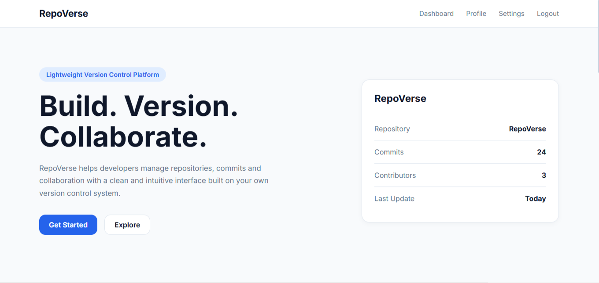

---

### 📊 Dashboard

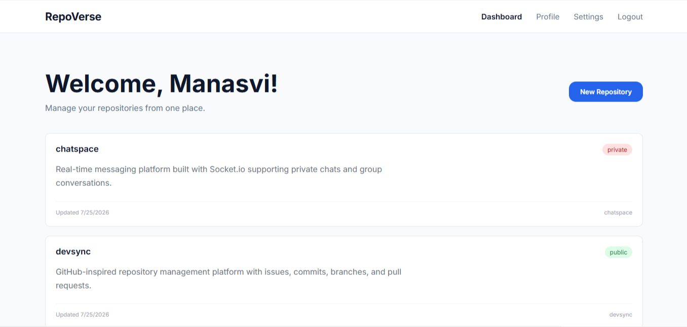

---

### 📁 Repository Details

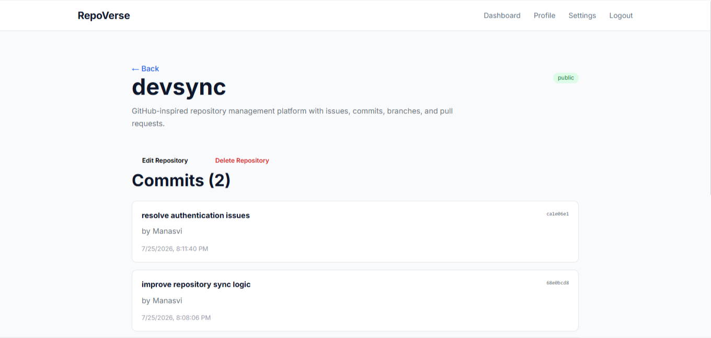

---

### 🐞 Issue Management

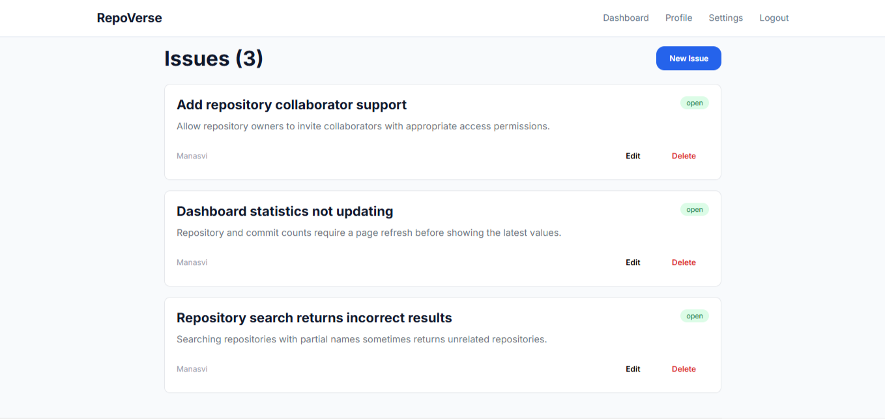

---

### 👤 Profile

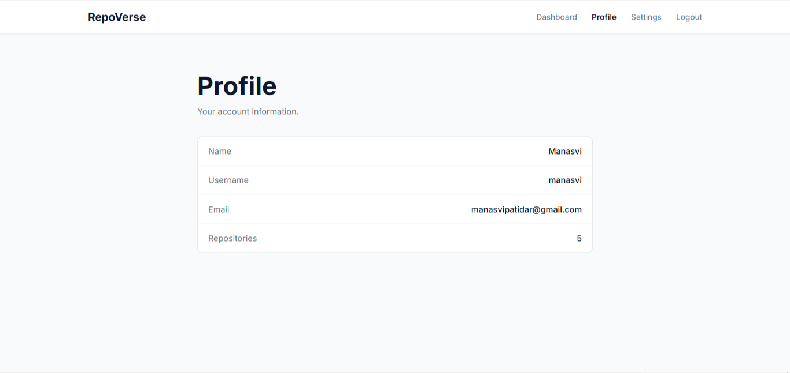

---

### ⚙️ Settings

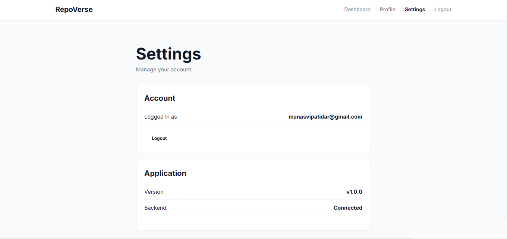

---

# 💻 CLI Preview

### Initialize Repository

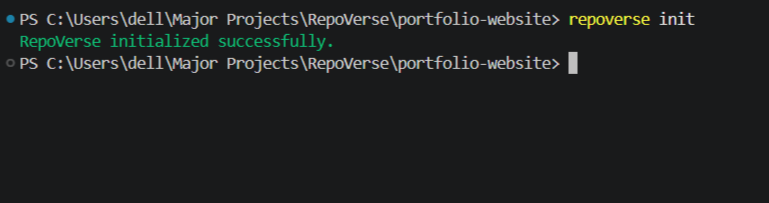

---

### Login

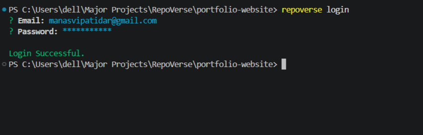

---

### Stage Files

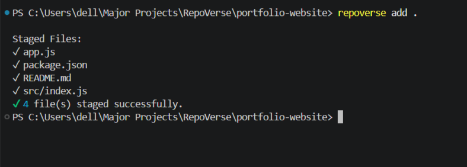

---

### Create Commit

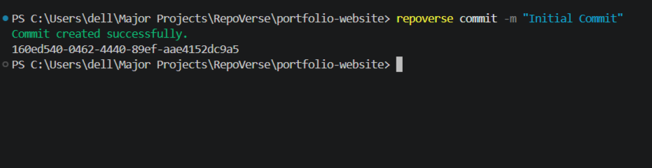

---

### View Commit History

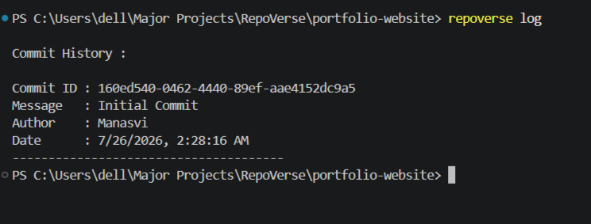

---

### Push Commit

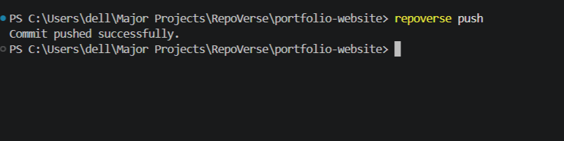

---

### Clone Repository

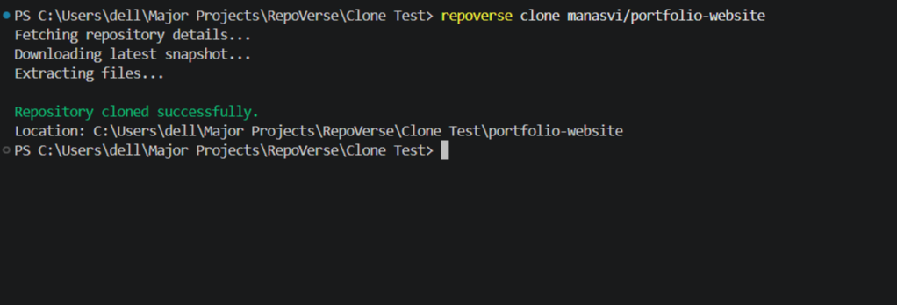

---

### Pull Latest Snapshot

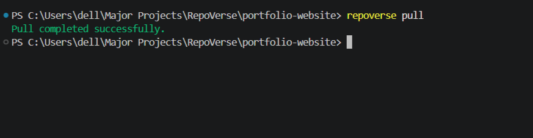

---

### Restore Previous Commit

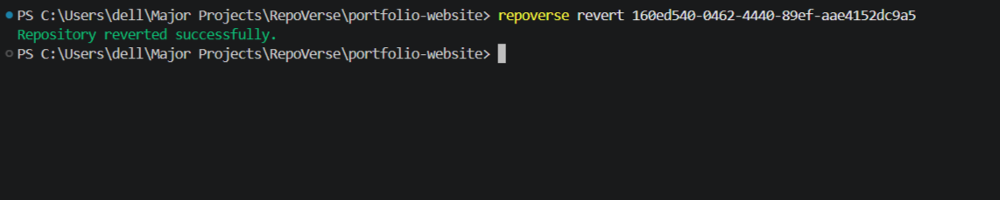

---

## 📁 Repository Structure

```text
RepoVerse/
│
├── backend/              # Express.js REST API
├── frontend/             # React Web Application
├── cli/                  # Custom Node.js CLI
│
├── assets/
│   ├── frontend/
│   └── cli/
│
├── README.md
└── DEVELOPER_GUIDE.md
```

---

## 📌 Future Scope

- Branch Support
- Pull Requests
- Repository Collaborators
- Commit Difference Viewer
- Repository Search
- Activity Timeline
- Notifications
- Repository Stars
- Cloud File Storage
- Dark Mode

---

## 👨‍💻 Author

**Manasvi Patidar**

RepoVerse is developed as a full-stack project to explore distributed version control concepts, REST API development, authentication, repository management, issue tracking, and command-line application development using the MERN stack and Node.js.
